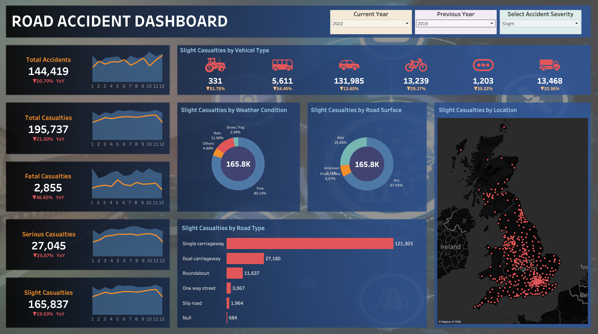
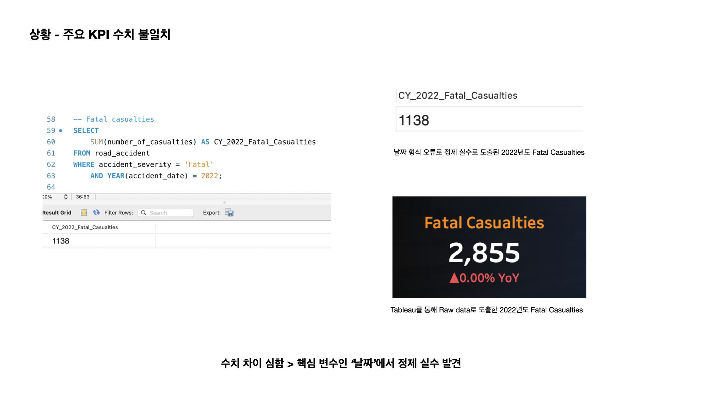
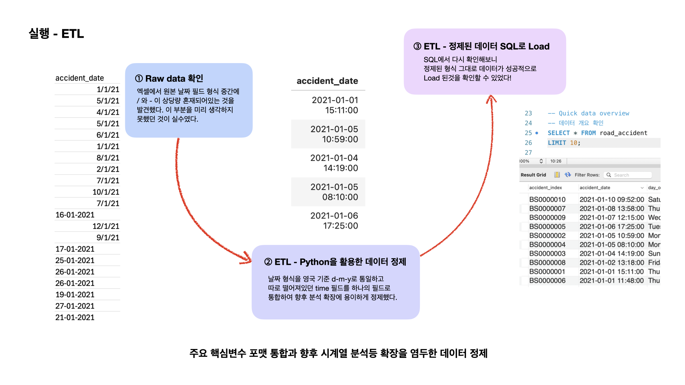
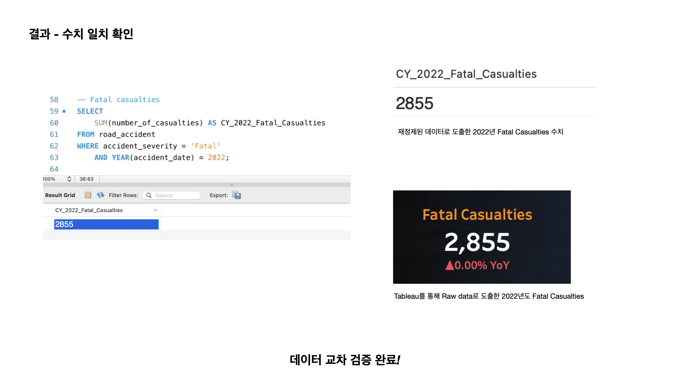

# 🚗 Road Accident Analysis  

## 📊 프로젝트 개요  
영국 도로교통청의 공개 데이터를 활용하여 연도별 교통사고 발생 패턴과 주요 위험 요인을 파악하고, 정책 수립 및 안전 개선을 위한 핵심 KPI를 시각화한 프로젝트입니다. 데이터 정제부터 시각화 대시보드까지의 **엔드 투 엔드(End-to-End)** 분석 프로세스를 **실무 환경처럼 재현해보기위해 시도했습니다.**

이 프로젝트는 단순한 데이터 분석을 넘어, **실제 데이터 분석가로서 클라이언트의 요구사항을 이해하고 이를 해결하는 과정을 체험·학습하는 것**을 목표로 진행되었습니다.  
즉, 분석 목적 정의 → KPI 도출 → 보고용 시각화 설계까지의 **실무형 비즈니스 분석 프로세스 전반을 재현**했습니다.     

---

## 🧩 분석 프로세스 

**Prototype-Driven EDA → Validation**

이 프로젝트는 완벽한 데이터 정제 단계에서 시작하기보다는,  
**빠른 시각화 프로토타입을 통해 인사이트의 방향성을 탐색한 뒤,  
SQL과 Python으로 이를 교차 검증하며 정제·모델링을 보완하는 방식**으로 진행되었습니다.  

이를 통해 실제 비즈니스 요구에 맞춰 유연하게 가설을 검증하는 흐름을 경험했습니다.  
프로세스는 아래와 같습니다.  

1. **Requirement Gathering (요구사항 정의)**  
교통사고 데이터를 통해 파악해야 할 핵심 질문과 KPI 설정

2. **Stakeholder Analysis (이해관계자 분석)**  
데이터 활용 대상 정의 및 각 이해관계자의 의사결정 포인트 및 리포팅 요구사항 정리  

3. **Raw Data Overview & BI Prototyping (원본 데이터 탐색 및 프로토타입 시각화)**  
원본 데이터를 Tableau로 연결하여 초기 시각화 수행  
대시보드 청사진(Prototype) 설계 및 핵심 패턴 도출  

4. **Data Connection & Processing (데이터 연결 및 가공)**  
Pandas로 원본 CSV 데이터를 전처리 후 MySQL로 적재  

5. **Data Cleaning (데이터 정제 및 가공)**  
중복 레코드 제거 및 포맷 표준화  
불필요 컬럼 제거, 데이터 타입 통일, 날짜형 변환 수행

6. **Data Modelling (데이터 모델링 및 검증)**  
SQL을 활용해 KPI 및 주요 지표 검증  
CTE, Group By, Window Function을 활용한 모델 구조 설계 

7. **Data Visualization Refinement (시각화 고도화)**  
KPI 카드, 차트, 맵 시각화를 통합  
필터 인터랙션과 디자인 일관성 유지  

8. **Insights (인사이트 도출)**  
사고율이 높은 조건 및 지역 파악
각 이해관계자 관점에서 개선 가능한 포인트 제시     

---

### Primary KPI:
   - 연도별(YoY) 총 사고 건수 및 사망자 수  
   - 사고 심각도별 사고 건수 (Fatal / Serious / Slight)  
   - 차량 유형별 총 사고 건수  
   - 도로, 날씨 유형별 사고 비율
     
### Stakeholders:
본 대시보드는 다음과 같은 이해관계자들의 의사결정 지원을 목적으로 설계했습니다.
   - **Ministry of Transport** / **Road Transport Department**: 국가 및 지방 교통 정책 개선  
   - **Police Force / Emergency Services Department**: 사고 대응 및 예방 전략 수립  
   - **Public / Media**: 교통안전 인식 제고 및 사회적 관심 유도     

---

## 🔍 주요 분석 내용  

이 프로젝트는 실제 현업 상황이 아닌 개인 학습 프로젝트로,  
**데이터 분석가로서 문제를 정의하고 해결 과정을 보고하는 전 과정을 설계한 사례입니다.**  
데이터 그 자체의 인사이트보다 **분석 과정·방법·기술의 적용 경험**에 초점을 맞추었습니다.  
보고 대상자는 빠르고 정확하며 핵심적인 요약을 선호한다고 가정했습니다.     

### 문제 (Problem)  

- **분석 출발점 설정**  
   학습 환경에서의 가상의 보고 상황을 가정하고,  
   데이터셋을 확보한 뒤 ‘내가 실제 분석가라면 어떤 부분을 보고해야 할까?’를 중심으로 분석 방향을 설정했습니다.  
   빠른 결과 도출과 정확성 확보가 동시에 필요한 상황을 문제로 정의했습니다.  

- **분석 접근 방향 결정**  
   신입 분석가로서 제한된 시간 안에 명확한 결과를 내야 하는 상황에서,  
   전통적인 ‘정제 → 모델링 → 시각화’ 순서 대신  
   **먼저 BI 도구를 통해 빠르게 전체 구조를 파악하고 방향을 설정하는 전략을 선택했습니다.**    

### 행동 (Action)  

- **초기 프로토타입 시각화 및 KPI 도출**  
   주요 이해관계자의 KPI를 정리하고,  
   Tableau를 활용해 원본 데이터를 즉시 연결하여 빠른 시각화 초안(prototype)을 제작했습니다.  
   이 과정을 통해 분석 목표인 **핵심 KPI와 대시보드 구조 초안**을 확정할 수 있었습니다.  

- **데이터 정제 및 교차 검증 과정**  
   원본 데이터의 품질 한계를 보완하기 위해 Python으로 데이터 정제를 수행했습니다.  
   이후 SQL을 활용해 KPI 수치를 교차 검증하여 정확성을 확보하려고 했습니다.  

- **데이터 품질 이슈 발견 및 해결**
   그러나 ‘날짜’ 변수의 형식이 혼합되어 (/와 -, 일/월/년 등) 수치에 오류가 발생했습니다.  
   영국 표준 날짜 형식(DD/MM/YYYY)을 기준으로 **mixed format 데이터 재정제**를 수행했습니다.  
   시간 변수는 향후 분석의 확장을 고려해 날짜 변수와 통합하여 단일 필드로 구성해두었습니다.  

- **결과 검증 및 보고 가능 형태로 정리**  
   날짜 형식 재정제 후 KPI 수치를 검증한 결과, 타블로로 만든 목표 수치와 드디어 일치했습니다.  
   보고자가 쿼리와 결과값을 근거로 검증을 요청할 경우,  
   **SQL 쿼리 및 산출 수치를 별도 문서로 제시할 수 있는 방법도 구상했습니다.**  

- **시각화 표현 개선 및 의사결정자 관점 반영**  
   초기 프로토타입에서는 YoY 변화율을 음수(-)로 표시하였으나,  
   **의사결정자가 ‘부정적 기호’로 인식할 가능성**을 고려하여  
   변화 방향을 직관적으로 보여주는 **아이콘·기호 중심의 표현 방식으로 개선했습니다.**    

### 결과 (Result)  

- **분석을 통해 얻은 인식**  
   분석의 핵심은 수치 계산 이상의 과정임을 체감하였습니다.  
   **분석가의 태도, 분석 목적의 명확성, 그리고 보고 대상자 중심의 커뮤니케이션이**  
   데이터 기술만큼이나 중요하다는 점을 배울 수 있었습니다.     

---

## 📈 결과 요약  

이 프로젝트는 단순한 데이터 분석이 아니라,  
탐색적 분석(Exploratory Analysis)과 교차 검증(Validation)을 결합하여  
실무형 데이터 분석가로서의 사고 프로세스를 학습하는 데 초점을 두는 분석이었기 때문에  
성과는 아래와 같습니다.  

### 기술적 성과 (Technical Outcomes)  
- **Tableau 기반 교통사고 KPI 대시보드 완성** 
- **데이터 클리닝 및 ETL 자동화 프로세스 구축**
- **혼합 날짜 형식(mixed date format) 처리 경험**
- **SQL 쿼리 문서화 및 KPI 검증 로직 명확화** 

### 정성적 성과 (Qualitative Outcomes)  
- **탐색 중심 접근을 통한 빠른 방향 설정 역량 강화**  
- **비즈니스 보고 시각화 관점 습득**  
- **데이터 해석과 기술의 균형적 사고 확립**  
- **분석가로서의 태도와 커뮤니케이션 감각 체득**     

---

## 🧭 미리보기  

   

   

---

## ⚙️ 기술 스택  
- **Language & Environment**: Python (Pandas)
- **Database**: MySQL (ETL, KPI Aggregation, Query Validation)
- **Visualization**: Tableau (Interactive Dashboard)
- **Version Control**: Git & GitHub

   

---

## 📂 파일 구성  
| 파일명 | 설명 |
|--------|------|
| `road_accident_complete_etl.ipynb` | ETL 및 데이터 정제 코드 |
| `road_accident_eda.sql` | SQL 분석 쿼리 |
| `road_accident_kpi_dashboard.twbx` | Tableau 대시보드 파일 |
| `road_accident_kpi_dashboard.png` | 대시보드 미리보기 이미지 |
| `README.md` | 프로젝트 문서 |
